<b id="head" style="color: #585554; font-size: 24px; font-weight: 900; margin-left: -20px;margin-left:-20px;font-weight:900;font-size:24;text-shadow:0 1px 0 #ccc, 0 2px 0 #c9c9c9, 0 3px 0 #bbb, 0 4px 0 #b9b9b9, 0 5px 0 #aaa, 0 6px 1px rgba(0,0,0,.1), 0 0 5px rgba(0,0,0,.1), 0 1px 3px rgba(0,0,0,.3), 0 3px 5px rgba(0,0,0,.2), 0 5px 10px rgba(0,0,0,.25), 0 10px 10px rgba(0,0,0,.2), 0 20px 20px rgba(0,0,0,.15)"><i>Artificial Cluster</i></b>

### Artificial Cluster (AC): A data generator for evaluation of clustering

See details: https://doi.org/10.36227/techrxiv.19091330

Online: http://ac.fwgenetics.org

Clustering has important applications in many fields. However, there are not enough benchmark datasets with rich characteristics for the development and evaluation of clustering algorithms, so the clustering performance cannot be truly evaluated. Neither real data nor manually synthetic data can solve this problem. We propose a new data generator, Artificial Cluster (AC), that can thoroughly customize the cluster characteristics that affect clustering, such as sample size, density, overlap and shape. The randomization of the default parameters enables AC to efficiently generate benchmark datasets with different characteristic combinations that can be used to evaluate the robustness of clustering algorithms. We evaluated nine popular clustering algorithms using an example benchmark dataset generated by AC. From the results, the advantages and disadvantages of these algorithms can be clearly seen. AC is expected to provide sufficient data support for clustering research.

    <h4 class="py-2" style="padding-bottom:.5rem !important;padding-top:.5rem !important">Hypothesis</h4>
    
1. The clusters in a dataset are always represented in a tree structure. More complex clusters are composed of smaller clusters. The clusters located at leaf nodes cannot be further divided, and we call them unit clusters (UCs).

    
2. The UC's samples follow an isotropic normal distribution, which means that the samples in each dimension of the UC follow a normal distribution.

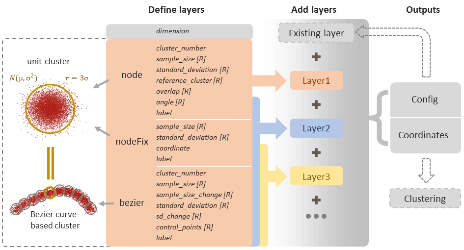
<a class="badge badge-primary" href="#Arguments" style="font-size: 17px;padding:10px; margin-top: 20px">Check Arguments</a>

<h4 style="padding: 20px 0"><b>Usage</b>: Three Generation Models</h4>

    

        <b>node</b><i>: Add UCs by relative positioning</i>
    

    

        
All parameters:

        

            
-t=node -nodeNum=1 -ss=1000 -sd=1 -overlap=0 -angle=0,0 -ref=0 -label=0 -cross=0

            

            
<i>"-label" is specified only if multiple clusters need to be merged.</i>

            
<i>"-cross" is specified only if the arguments are in conflict.</i>

        

        
Specify the number of clusters to add on this layer:

        

            
-t=node <b style="color: #61080f">-nodeNum=1</b> -ss=1000 -sd=1 -overlap=0 <t style="color: #736e63">-angle=0,0 -ref=0</t>

            

            
<i>"-angle" and "-ref" are forced to be random When "-nodeNum" is greater than 1.</i>

        

        

            

                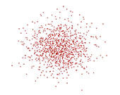
                

                    <small class="text-muted">-nodeNum=1</small>
                

            

            

                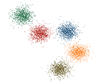
                

                    <small class="text-muted">-nodeNum=5</small>
                

            

            

                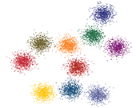
                

                    <small class="text-muted">-nodeNum=10</small>
                

            

            

                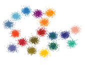
                

                    <small class="text-muted">-nodeNum=20</small>
                

            

            

                
                

                    <small class="text-muted">-nodeNum=30</small>
                

            

        

         
        
Control sample size:

        

            
-t=node <b style="color: #61080f">-ss=1000</b> -sd=1

        

        

            

                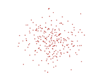
                

                    <small class="text-muted">-ss=250</small>
                

            

            

                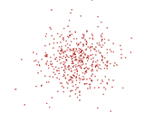
                

                    <small class="text-muted">-ss=500</small>
                

            

            

                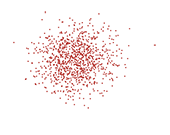
                

                    <small class="text-muted">-ss=1000</small>
                

            

            

                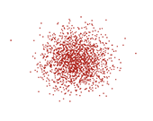
                

                    <small class="text-muted">-ss=2000</small>
                

            

            

                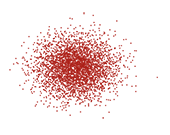
                

                    <small class="text-muted">-ss=4000</small>
                

            

        

         
        
Control Standard Deviation:

        

            
-t=node -ss=1000 <b style="color: #61080f">-sd=0.25</b> -overlap=-2 -angle=0,0

            
-t=node -ss=1000 <b style="color: #61080f">-sd=0.5</b> -overlap=-2 -angle=0,0 <b>-ref=0</b>

            
-t=node -ss=1000 <b style="color: #61080f">-sd=1</b> -overlap=-2 -angle=0,0 <b>-ref=1</b>

            
-t=node -ss=1000 <b style="color: #61080f">-sd=1.5</b> -overlap=-2 -angle=0,0 <b>-ref=2</b>

            
-t=node -ss=1000 <b style="color: #61080f">-sd=2</b> -overlap=-2 -angle=0,0 <b>-ref=3</b>

            
-t=node -ss=1000 <b style="color: #61080f">-sd=2.5</b> -overlap=-2 -angle=0,0 <b>-ref=4</b>

        

        

            

                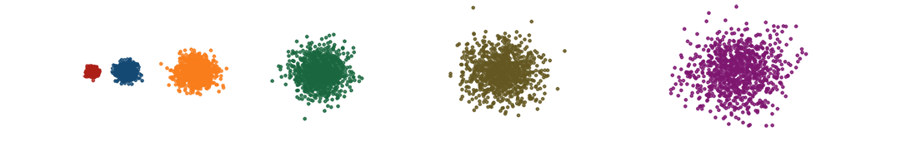
                <!--
-->
                    <!--<small class="text-muted">-sd=0.25</small>-->
                <!--
-->
            

        

         
        
Control Overlap:

        

            
-t=node -ss=1000 -sd=1 <b style="color: #61080f">-overlap=-10</b> -angle=0,0

            
-t=node -ss=1000 -sd=1 <b style="color: #61080f">-overlap=-5</b> -angle=0,0 <b>-ref=0</b>

            
-t=node -ss=1000 -sd=1 <b style="color: #61080f">-overlap=-2.5</b> -angle=0,0 <b>-ref=1</b>

            
-t=node -ss=1000 -sd=1 <b style="color: #61080f">-overlap=0</b> -angle=0,0 <b>-ref=2</b>

            
-t=node -ss=1000 -sd=1 <b style="color: #61080f">-overlap=0.5</b> -angle=0,0 <b>-ref=3</b>

            
-t=node -ss=1000 -sd=1 <b style="color: #61080f">-overlap=1</b> -angle=0,0 <b>-ref=4</b>

            
-t=node -ss=1000 -sd=1 <b style="color: #61080f">-overlap=1.5</b> -angle=0,0 <b>-ref=5</b>

            
-t=node -ss=1000 -sd=1 <b style="color: #61080f">-overlap=2</b> -angle=0,0 <b>-ref=6</b>

        

        

            

                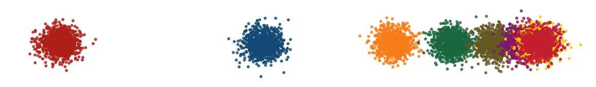
            

        

         
        
Control Angle:

        

            
-t=node -ss=200 -sd=1

            
-t=node -ss=200 -sd=1 -overlap=-0.5 <b style="color: #61080f">-angle=0,30</b> <b>-ref=0</b>

            
-t=node -ss=200 -sd=1 -overlap=-0.5 <b style="color: #61080f">-angle=0,45</b> <b>-ref=1</b>

            
-t=node -ss=200 -sd=1 -overlap=-0.5 <b style="color: #61080f">-angle=0,60</b> <b>-ref=2</b>

            
-t=node -ss=200 -sd=1 -overlap=-0.5 <b style="color: #61080f">-angle=0,60</b> <b>-ref=3</b>

            
-t=node -ss=200 -sd=1 -overlap=-0.5 <b style="color: #61080f">-angle=0,45</b> <b>-ref=4</b>

            
-t=node -ss=200 -sd=1 -overlap=-0.5 <b style="color: #61080f">-angle=0,30</b> <b>-ref=5</b>

            
-t=node -ss=200 -sd=1 -overlap=-0.5 <b style="color: #61080f">-angle=0,0</b> <b>-ref=6</b>

            
-t=node -ss=200 -sd=1 -overlap=-0.5 <b style="color: #61080f">-angle=0,330</b> <b>-ref=7</b>

            
-t=node -ss=200 -sd=1 -overlap=-0.5 <b style="color: #61080f">-angle=0,315</b> <b> -ref=8</b>

            
-t=node -ss=200 -sd=1 -overlap=-0.5 <b style="color: #61080f">-angle=0,300</b> <b> -ref=9</b>

            
-t=node -ss=200 -sd=1 -overlap=-0.5 <b style="color: #61080f">-angle=0,300</b> <b> -ref=10</b>

            
-t=node -ss=200 -sd=1 -overlap=-0.5 <b style="color: #61080f">-angle=0,315</b> <b> -ref=11</b>

            
-t=node -ss=200 -sd=1 -overlap=-0.5 <b style="color: #61080f">-angle=0,330</b> <b> -ref=12</b>

            
-t=node -ss=200 -sd=1 -overlap=-0.5 <b style="color: #61080f">-angle=0,0</b> <b> -ref=13</b>

            
-t=node -ss=200 -sd=1 -overlap=-0.5 <b style="color: #61080f">-angle=0,0</b> <b> -ref=14</b>

            
-t=node -ss=200 -sd=1 -overlap=-0.5 <b style="color: #61080f">-angle=0,30</b> <b> -ref=15</b>

            
-t=node -ss=200 -sd=1 -overlap=-0.5 <b style="color: #61080f">-angle=0,45</b> <b> -ref=16</b>

            
-t=node -ss=200 -sd=1 -overlap=-0.5 <b style="color: #61080f">-angle=0,60</b> <b> -ref=17</b>

            
-t=node -ss=200 -sd=1 -overlap=-0.5 <b style="color: #61080f">-angle=0,60</b> <b> -ref=18</b>

            
-t=node -ss=200 -sd=1 -overlap=-0.5 <b style="color: #61080f">-angle=0,45</b> <b> -ref=19</b>

            
-t=node -ss=200 -sd=1 -overlap=-0.5 <b style="color: #61080f">-angle=0,30</b> <b> -ref=20</b>

            
-t=node -ss=200 -sd=1 -overlap=-0.5 <b style="color: #61080f">-angle=0,0</b> <b> -ref=21</b>

            
-t=node -ss=200 -sd=1 -overlap=-0.5 <b style="color: #61080f">-angle=0,330</b> <b> -ref=22</b>

            
-t=node -ss=200 -sd=1 -overlap=-0.5 <b style="color: #61080f">-angle=0,315</b> <b> -ref=23</b>

            
-t=node -ss=200 -sd=1 -overlap=-0.5 <b style="color: #61080f">-angle=0,300</b> <b> -ref=24</b>

            
-t=node -ss=200 -sd=1 -overlap=-0.5 <b style="color: #61080f">-angle=0,300</b> <b> -ref=25</b>

            
-t=node -ss=200 -sd=1 -overlap=-0.5 <b style="color: #61080f">-angle=0,315</b> <b> -ref=26</b>

            
-t=node -ss=200 -sd=1 -overlap=-0.5 <b style="color: #61080f">-angle=0,330</b> <b> -ref=27</b>

            
-t=node -ss=200 -sd=1 -overlap=-0.5 <b style="color: #61080f">-angle=0,0</b> <b> -ref=28</b>

        

        

            

                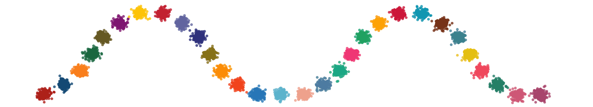
            

        

    

 

    

        <b>nodeFix</b><i>: Add UCs by absolute positioning</i>
    

    

        
All parameters:

        

            -t=nodeFix -ss=1000 -sd=1 -coordinate=0 -label=0
        

        
Examples:

        

            
-t=nodeFix -ss=1000 -sd=1 <b style="color: #61080f">-coordinate=0,0</b>

            
-t=nodeFix -ss=1000 -sd=1 <b style="color: #61080f">-coordinate=10,0</b>

            
-t=nodeFix -ss=1000 -sd=1 <b style="color: #61080f">-coordinate=20,2</b>

            
-t=nodeFix -ss=1000 -sd=1 <b style="color: #61080f">-coordinate=20,-2</b>

            
-t=nodeFix -ss=1000 -sd=1 <b style="color: #61080f">-coordinate=30,0</b>

            
-t=nodeFix -ss=1000 -sd=1 <b style="color: #61080f">-coordinate=40,0</b>

        

        

            

                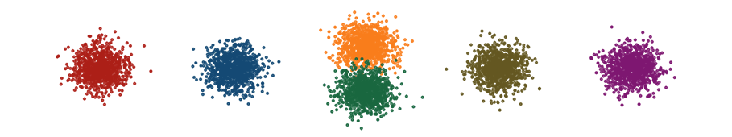
            

        

    

 

    

        <b>bezier</b><i>: Add Bezier curve-based clusters (BCs)</i>
    

    

        
All parameters:

        

            -t=bezier -bezierNum=1 -ss=1000 -rss=1 -sd=1 -rsd=0 -control=0,0 -label=0 -offset=0
            

            
<i>"-label" is specified only if multiple clusters need to be merged.</i>

            
<i>"-offset" is specified only if the BC need to be translated.</i>

        

        
Examples:

        

            -t=bezier -ss=500 -rss=0 <b style="color: #61080f">-sd=0.1</b> -rsd=0 -control=6,6,12,0,6,-6 
            -t=bezier -ss=500 -rss=0 <b style="color: #61080f">-sd=0.3</b> -rsd=0 -control=12,6,18,0,12,-6 
            -t=bezier -ss=500 -rss=0 <b style="color: #61080f">-sd=0.5</b> -rsd=0 -control=18,6,24,0,18,-6 
            -t=bezier -ss=500 <b style="color: #61080f">-rss=-50</b> -sd=0.1 <b style="color: #61080f">-rsd=5</b> -control=24,6,30,0,24,-6 
            -t=bezier -ss=500 <b style="color: #61080f">-rss=50</b> -sd=0.1 <b style="color: #61080f">-rsd=5</b> -control=30,6,36,0,30,-6 
            -t=bezier -ss=500 <b style="color: #61080f">-rss=-50</b> -sd=0.5 <b style="color: #61080f">-rsd=-5</b> -control=36,6,42,0,36,-6 
            -t=bezier -ss=500 <b style="color: #61080f">-rss=50</b> -sd=0.5 <b style="color: #61080f">-rsd=-5</b> -control=42,6,48,0,42,-6 
        

        

            

                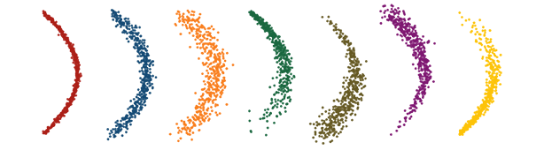
            

        

    

 

    

        Splice clusters with <i>-label</i>
    

    

        
Examples:

        

            -t=node -ss=1000 -sd=1 -overlap=0 -angle=0,0 
            -t=node -ss=1000 -sd=1 -overlap=0 -ref=0 -angle=0,0 
            -t=node -ss=1000 -sd=1 -overlap=-2 -ref=1 -angle=0,0 
            -t=node -ss=1000 -sd=1 -overlap=0 -ref=2 -angle=0,0 <b style="color: #61080f">-label=2</b> 
            -t=bezier -ss=1000 -rss=-10 -sd=0.5 -rsd=-3 -control=40,5,32,5,32,-5,40,-5 
            -t=bezier -ss=1000 -rss=-10 -sd=0.5 -rsd=-3 -control=40,5,48,5,48,-5,40,-5 
            -t=bezier -ss=1000 -rss=-10 -sd=0.5 -rsd=-3 -control=60,5,52,5,52,-5,60,-5 
            -t=bezier -ss=1000 -rss=-10 -sd=0.5 -rsd=-3 -control=60,5,68,5,68,-5,60,-5 <b style="color: #61080f">-label=6</b> 
        

        

            

                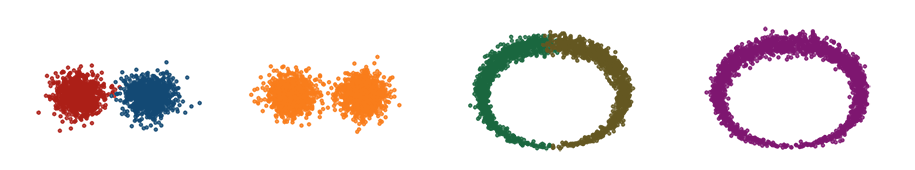
            

        

    

 

    

        Add UC at the specified location of BC by <i>-ref</i>
    

    

        
Examples:

        

            <b style="color: #6c757d">reference: </b> 
            -t=node -ss=1000 -sd=1 
            -t=node -ss=1000 -sd=1 -overlap=0 <b style="color: #61080f">-ref=0</b> -angle=0,0 
            -t=bezier -ss=1000 -rss=0 -sd=0.3 -rsd=0 -control=10,0,16,5,22,0 
            -t=node -ss=1000 -sd=1 -overlap=0 <b style="color: #61080f">-ref=202</b> -angle=0,0 
            -t=node -ss=1000 -sd=1 -overlap=0 <b style="color: #61080f">-ref=203</b> -angle=0,0 
        

        

            

                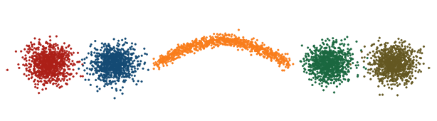
                

                    <small class="text-muted">reference</small>
                

            

            

                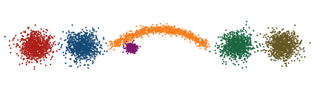
                

                    <small class="text-muted">In the 20% position</small>
                    <!--<small class="text-muted">-t=node -ss=500 -sd=0.3 -overlap=-10 -ref=21 -angle=0,270 -cross=1</small>-->
                

            

            

                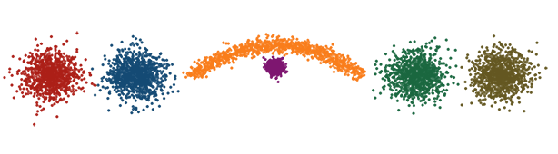
                

                    <small class="text-muted">In the 50% position</small>
                    <!--<small class="text-muted">-t=node -ss=500 -sd=0.3 -overlap=-10 -ref=101 -angle=0,270 -cross=1</small>-->
                

            

            

                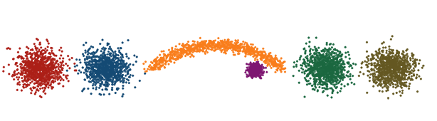
                

                    <small class="text-muted">In the 80% position</small>
                    <!--<small class="text-muted">-t=node -ss=500 -sd=0.3 -overlap=-10 -ref=161 -angle=0,270 -cross=1</small>-->
                

            

        

        

            <small class="text-muted"><b>20%: </b><t style="color: #856404;">-t=node -ss=500 -sd=0.3 -overlap=-10 <b style="color: #61080f">-ref=41</b> -angle=0,270 -cross=1</t></small>
            <i style="color: #6c757d;font-size: 14px"> (41=200*20%+1)</i> 
            <small class="text-muted"><b>50%: </b><t style="color: #856404;">-t=node -ss=500 -sd=0.3 -overlap=-10 <b style="color: #61080f">-ref=101</b> -angle=0,270 -cross=1</t></small>
            <i style="color: #6c757d;font-size: 14px"> (101=200*50%+1)</i> 
            <small class="text-muted"><b>80%: </b><t style="color: #856404;">-t=node -ss=500 -sd=0.3 -overlap=-10 <b style="color: #61080f">-ref=161</b> -angle=0,270 -cross=1</t></small>
            <i style="color: #6c757d;font-size: 14px"> (161=200*80%+1)</i> 
        

    

 

    

        Randomization
    

    

        

            <b style="color: #6c757d">Random UCs: </b> 
            -t=node -nodeNum=5
        

        

            

                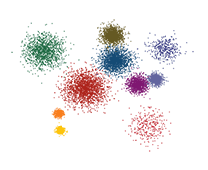
            

            

                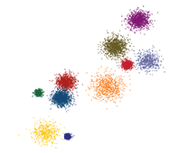
            

            

                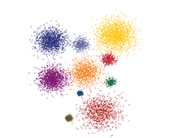
            

            

                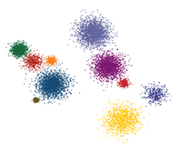
            

            

                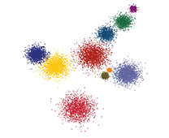
            

        

         
        

            <b style="color: #6c757d">Random BCs: </b> 
            -t=bezier -bezierNum=5
        

        

            

                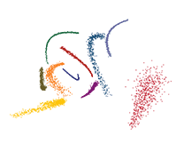
            

            

                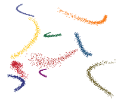
            

            

                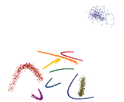
            

            

                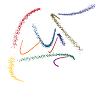
            

            

                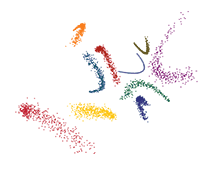
            

        

         
        

            <b style="color: #6c757d">Random 5BCs + 5UCs: </b> 
            -t=bezier -bezierNum=5 
            -t=node -nodeNum=5
        

        

            

                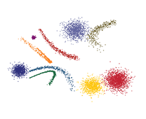
            

            

                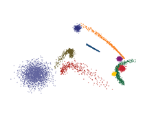
            

            

                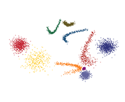
            

            

                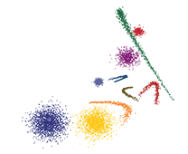
            

            

                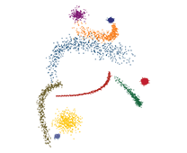
            

        

         
    

 
<h4 id="Arguments" style="padding: 20px 0">Arguments</h4>
<table class="table table-sm table-easy table-hover table-striped align-middle">
    <thead><tr>
        <th>Parameters</th><th>Description</th><th>Value</th><th>Example</th><th>Default</th>
    </tr>
    </thead>
    <tbody style="font-size: 14px; line-height: 15px">
    <tr><td colspan="5"><b style="color: #8b3403;">Public parameters</b></td></tr>
    <tr><td>-d</td><td>Dimension</td><td>Positive integer</td><td>-d=2</td><td>2</td></tr>
    <tr><td>-o</td><td>Output</td><td>FilePath</td><td>
-o=/home/work/

-o=E:/work/

-o=/home/coordiante.txt
</td><td>Current directory</td></tr>
    <tr><td>-rg</td><td>
        
Regenerate according to the original parameters in a parameter configure file

    </td><td>FilePath</td><td>-rg=/home/myConfig.txt</td><td><i>None</i></td></tr>
    <tr><td>-rp</td><td>
        
Reproduce according to a parameter configure file

    </td><td>FilePath</td><td>-rp=/home/myConfig.txt</td><td><i>None</i></td></tr>
    <tr><td colspan="5"><b style="color: #8b3403;">Private parameters</b></td></tr>
    <tr><td>-t</td><td>
            
Three generation models:

            
node = add UCs using relative positioning

            
nodeFix = add UCs using absolute positioning

            
bezier = add BCs

        </td><td>node/nodeFix/bezier</td><td>-t=node</td><td>Required if "-rg/rp" is not specified</td></tr>
    <tr><td colspan="5" style="color: #8b3403;">Parameters for <i>-t=node</i></td></tr>
    <tr><td>-nodeNum</td><td>The number of UCs to add to the current layer</td><td>Positive integer</td><td>-nodeNum=5</td><td>1</td></tr>
    <tr><td>-ss</td><td>The sample size for each cluster to add to the current layer</td><td>Positive integer</td><td>-ss=500</td><td>300*(1+SD*random(0,1))</td></tr>
    <tr><td>-sd</td><td>The standard deviation of normal distribution</td><td>Positive number</td><td>-sd=1</td><td>1+10*random(0,1)</td></tr>
    <tr><td>-ref</td><td>The reference UC for the new cluster. All UCs are numbered sequentially from 0-n. Each BC consists of multiple (default 200) UCs.</td><td>A positive integer less than the number of added UCs.</td><td>-ref=1</td><td>round(random(0,1)*UC_Num)</td></tr>
    <tr><td>-overlap</td><td>The overlap between the new cluster and the reference cluster. It is also the largest overlap between the new cluster and other clusters.</td><td>Number</td><td>-overlap=0</td><td>[0.7*random(0,1), -1*random(0,1)]</td></tr>
    <tr><td>-angle</td><td>The vector of the new cluster's counterclockwise rotation angle, relative to the reference UC in each dimension</td><td>Number vector. The first dimension does not need to be rotated and is denoted as 0</td><td>-angle=0,30</td><td>360*random(0,1)</td></tr>
    <tr><td>-label</td><td>Specify a label for the new cluster</td><td>Integer</td><td>-label=1</td><td>Increment</td></tr>
    <tr><td>-cross</td><td>Whether clusters with conflicting parameters are shown (default is not displayed)</td><td>0/1</td><td>-cross=0</td><td>0</td></tr>
    <tr><td colspan="5" style="color: #8b3403;">Parameters for <i>-t=nodeFix</i></td></tr>
    <tr><td>-ss</td><td colspan="4">Same as <i>-ss</i> in <i>-t=node</i></td></tr>
    <tr><td>-sd</td><td colspan="4">Same as <i>-sd</i> in <i>-t=node</i></td></tr>
    <tr><td>-label</td><td colspan="4">Same as <i>-label</i> in <i>-t=node</i></td></tr>
    <tr><td>-coordinate</td><td>The centre coordinates of the new cluster</td><td>Number vector</td><td>-coordinate=2,3</td><td>Required</td></tr>
    <tr><td colspan="5" style="color: #8b3403;">Parameters for <i>-t=bezier</i></td></tr>
    <tr><td>-bezierNum</td><td>The number of BCs to add to the current layer</td><td>Positive integer</td><td>-nodeNum=5</td><td>1</td></tr>
    <tr><td>-ss</td><td colspan="3">Same as <i>-ss</i> in <i>-t=node</i></td><td>300*(1+SD*random(0,1))</td></tr>
    <tr><td>-rss</td><td>The ratio of the ending sample size to the starting sample size</td><td>Positive numbers represent increases and negative numbers represent decreases. See publication for details.</td><td>-rss=10</td><td>[10*random(0,1), -10*random(0,1)]</td></tr>
    <tr><td>-sd</td><td colspan="3">Same as <i>-sd</i> in <i>-t=node</i></td><td>2.2-2.1*random(0,1)</td></tr>
    <tr><td>-rsd</td><td>The ratio of the ending SD to the starting SD</td><td>Positive numbers represent increases and negative numbers represent decreases. See publication for details.</td><td>-rsd=-2</td><td>[5*random(0,1), -5*random(0,1)]</td></tr>
    <tr><td>-control</td><td>The control point of the Bezier curve</td><td>Number vector. The coordinate values of each control point are separated by commas</td><td>-control=2,3,12,13,16,-3</td><td>30*max(1,SD)*random(0,1)</td></tr>
    <tr><td>-label</td><td colspan="4">Same as <i>-label</i> in <i>-t=node</i></td></tr>
    <tr><td>-offset</td><td>The translation of the new BC in each dimension</td><td>Number vector</td><td>-offset=2,3</td><td><i>None</i></td></tr>
    </tbody>
</table>
